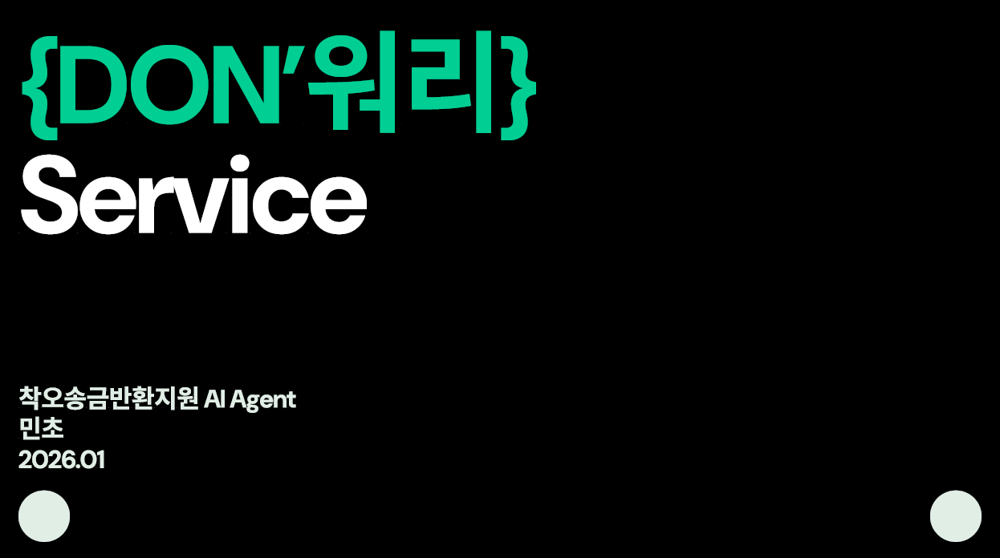
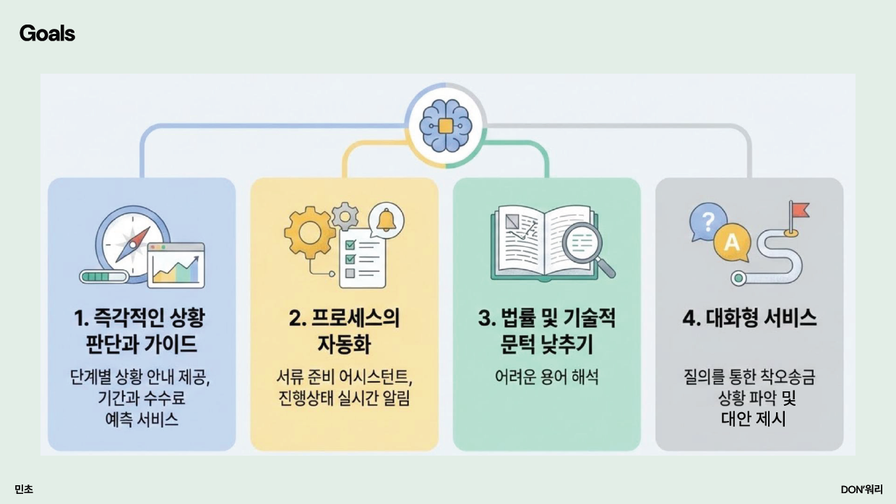

# 1차 프로젝트 기획서

# 🐷 DON ’ 워리 (Don't Worry)
> **착오송금으로 당황한 당신을 위한 AI 기반 원스톱 반환 지원 서비스**

착오송금 반환 과정의 복잡한 절차와 정보의 불투명성을 해결하고, 사용자가 쉽고 빠르게 돈을 돌려받을 수 있도록 돕는 DON ' 워리 서비스의 AI 에이전트 마스코트 '돈돌돌'입니다.

 
 

## 📌 주요 기능 (Key Features)
 

1.  **즉각적인 상황 판단 및 가이드**: 단계별 상황 안내 및 예상 반환 기간·수수료 예측 서비스 제공.
2.  **프로세스 자동화**: 복잡한 서류 준비 어시스트 및 실시간 진행 상태 알림.
3.  **법률 및 기술적 문턱 낮추기**: 이해하기 어려운 금융 및 법률 용어 자동 해석.
4.  **대화형 맞춤 서비스**: 챗봇 '돈돌돌'과의 질의응답을 통한 맞춤형 로드맵 제시.

 
 

## 🛠 Tech Stack

| 분류 | 기술 스택 |
| :--- | :--- |
| **Language** | TypeScript (App/API), Python (AI/OCR/Data) |
| **Frontend** | React Native, React Query, Figma (Design) |
| **Backend/Infra** | AWS (API Gateway, Lambda, EKS, Aurora/PostgreSQL) |
| **AI/ML** | ChatGPT (GPT-4o), LangChain, Amazon Extract (OCR), RAG |
| **DevOps** | GitHub Actions, Terraform, ArgoCD, Datadog |

 
 

## 📐 System Architecture

 
 

## 📊 Data Flow

 
 

## 📱 UI Preview

* 대시보드를 통해 현재 진행 단계와 예상 반환 금액을 한눈에 확인하여 사용자의 불안감을 해소합니다.

 
 

## 🚀 기대 효과 및 향후 과제

 
 

## 📍 프로젝트 일정
**Team 민초 (2026.01)**
*멤버: 강찬희, 김주혜, 이동현, 손소희*

